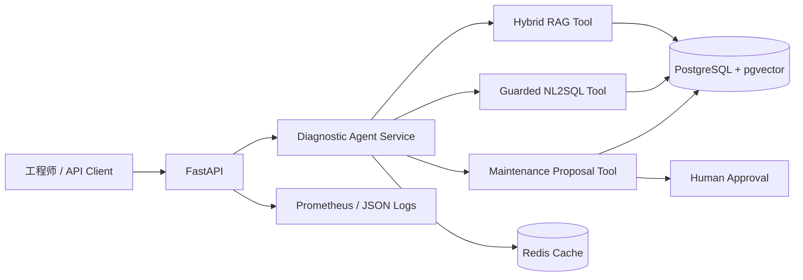

# FabCopilot

[](https://github.com/nobody213123/fabcopilot/actions/workflows/ci.yml)

FabCopilot 是面向半导体制造的良率诊断与维护协同智能体。首个场景聚焦扩散炉/热处理设备：系统把设备、批次、报警与维护知识组织成可追溯证据，通过混合 RAG、受限 NL2SQL 和 Agent 工具调用辅助工程师诊断；停机等高风险动作只生成待审批提案，不会由模型直接执行。

> 仓库中的演示数据均为合成数据，不代表真实晶圆厂数据。项目不声称已用于生产决策。

## 已实现能力

- FastAPI 服务：设备、知识检索、分析查询、诊断 Agent、人工审批、健康与指标接口。
- PostgreSQL 17 + pgvector：SQLAlchemy 2.0 持久化与 Alembic 迁移。
- 混合 RAG：PostgreSQL 全文检索 + 1536 维向量 HNSW + Reciprocal Rank Fusion。
- 安全 NL2SQL：SQLGlot AST 校验、表白名单、只读事务、3 秒超时、最多 200 行。
- Agent：可切换离线规则模型或 OpenAI Responses API，工具轨迹完整返回。
- Human-in-the-loop：停机/维护提案持久化为 `pending`，必须由具名人员批准或拒绝。
- Redis：诊断结果 TTL 缓存、故障降级；含待审批结果不会进入缓存。
- 可观测性：结构化 JSON 日志、请求 ID、Prometheus 指标、存活与就绪探针。
- 工程化：非 root Docker 镜像、Compose 整栈、Ruff、pytest、GitHub Actions CI。

## 架构



代码采用端口与适配器思路：`domain` 保存业务规则，`application` 编排用例并定义端口，`infrastructure` 实现数据库、缓存、模型和检索，`api` 只负责 HTTP 边界。详细说明见 [架构文档](docs/architecture.md)。

## 使用 Docker 启动

前置条件：Docker Desktop（WSL 2 后端）。

```powershell
Copy-Item .env.example .env
# 仅在本机 .env 中修改 POSTGRES_PASSWORD 与 REDIS_PASSWORD
docker compose up -d app
docker compose ps
```

`migrate` 容器会先执行 Alembic，再启动 API。验证：

```powershell
Invoke-RestMethod http://127.0.0.1:8000/health
Invoke-RestMethod http://127.0.0.1:8000/ready
```

- Swagger UI: <http://127.0.0.1:8000/docs>
- Prometheus metrics: <http://127.0.0.1:8000/metrics>

载入可重复执行的合成演示数据：

```powershell
.\.venv\Scripts\python.exe -m fabcopilot.demo
```

## 本地 Python 开发

需要 Python 3.11+；本项目实际在 Python 3.13.7 上验收。

```powershell
py -3.13 -m venv .venv
.\.venv\Scripts\Activate.ps1
python -m pip install -e ".[dev]"
docker compose up -d postgres redis
alembic upgrade head
python -m pytest -q
python -m pytest -m integration -q
ruff check .
ruff format --check .
uvicorn fabcopilot.api.app:app --reload
```

## 典型调用

```powershell
$body = @{ prompt = "检查 DF-02 的报警和良率，并建议是否停机" } | ConvertTo-Json
Invoke-RestMethod -Method Post -Uri http://127.0.0.1:8000/agent/diagnose `
  -ContentType "application/json" -Body $body
```

返回值包含 `answer`、逐步 `tool_trace` 和 `pending_approval_ids`。如产生高风险提案，需要另行调用审批接口；Agent 的文本回答不是执行凭证。

主要接口：

| 方法 | 路径 | 用途 |
|---|---|---|
| `POST` | `/equipment` | 注册设备 |
| `GET` | `/equipment/{id}` | 查询设备 |
| `POST` | `/knowledge/documents` | 写入知识文档 |
| `GET` | `/knowledge/search` | 混合检索 |
| `POST` | `/analytics/query` | 受限自然语言分析 |
| `POST` | `/agent/diagnose` | 运行诊断 Agent |
| `GET` | `/approvals/{id}` | 查询审批单 |
| `POST` | `/approvals/{id}/decision` | 人工批准/拒绝 |
| `GET` | `/health`, `/ready`, `/metrics` | 运维接口 |

## 已验证指标

所有数字来自 2026-08-11 的本地实际运行，不是简历占位符：

- 自动化测试：52 个非集成测试、11 个真实基础设施集成测试通过。
- 离线 Agent 路由集：6/6 精确工具路由，6/6 审批安全判断。
- Docker 单进程、顺序 200 请求：`/health` p95 2.004 ms；`/ready` p95 3.224 ms。
- Docker 镜像成功构建，Compose 中 API、PostgreSQL、Redis 均通过健康检查。

基准只反映当前机器与本地容器条件，不等同于生产并发容量。复现命令与限制见 [评测报告](docs/evaluation.md)。

## 模型配置

没有密钥时使用确定性的离线规则模型，保证开发与 CI 可复现。设置 `FABCOPILOT_OPENAI_API_KEY` 后使用 OpenAI Responses API 适配器；默认模型由 `FABCOPILOT_OPENAI_MODEL` 控制。仓库和日志不会保存密钥，也不会记录请求正文。

## 文档

- [架构与关键设计](docs/architecture.md)
- [安全边界](docs/security.md)
- [运行与排障手册](docs/runbook.md)
- [评测方法与实测结果](docs/evaluation.md)
- [学习与面试讲解](docs/interview-guide.md)

## 下一步

当前是可运行的求职旗舰项目基线，不是已投产 MES。后续可加入真实嵌入模型、模型化 NL2SQL、身份认证/RBAC、审批通知、OpenTelemetry、异步任务与更多工艺模块；每项新能力仍须通过可复现测试后才能写入简历指标。
