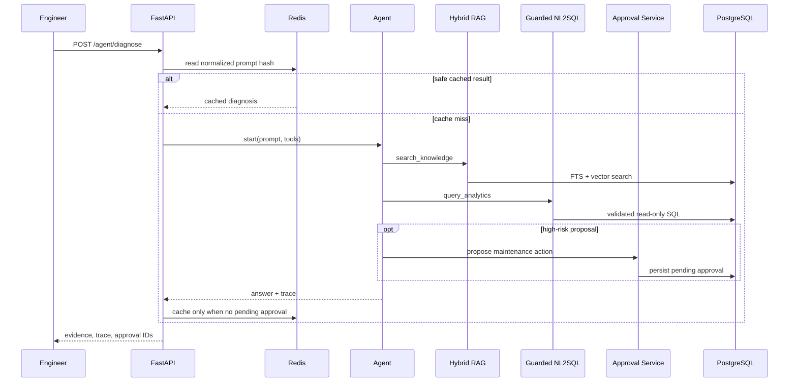

# 架构与关键设计

## 分层

| 层 | 职责 | 典型内容 |
|---|---|---|
| `domain` | 与框架无关的业务对象和不变量 | 设备类型、工艺运行、报警、审批状态 |
| `application` | 编排用例，声明外部能力端口 | 创建设备、诊断 Agent、Repository/Cache Protocol |
| `infrastructure` | 实现外部技术细节 | SQLAlchemy、pgvector、Redis、SQLGlot、模型适配器 |
| `api` | 校验 HTTP 输入并转换响应 | FastAPI 路由、Pydantic Schema、依赖注入 |

依赖方向指向内部：领域层不知道 FastAPI、PostgreSQL、Redis 或 OpenAI。这样可以用内存仓储和假模型做快速单测，再用集成测试验证真实基础设施。

## 诊断请求时序

## 混合 RAG

知识表同时维护 PostgreSQL `TSVECTOR` 与 1536 维 `VECTOR`。查询分别取得关键词排名和余弦距离排名，再用 Reciprocal Rank Fusion 合并。开发环境使用确定性 hashing embedding，优点是离线、无费用、测试可重复；缺点是语义能力弱，因此生产替换真实 embedding 模型时必须重新评测召回率。

## NL2SQL 防护

生成器和执行器之间有独立安全边界：

1. SQLGlot 解析 AST，只允许单条 Query。
2. 只允许 `equipment`、`process_run`、`alarm_event` 三张表。
3. 禁止 DML/DDL/Command、危险函数和非计数型 `SELECT *`。
4. 自动限制最多 200 行。
5. PostgreSQL 事务设置为只读，语句超时 3 秒。

这是纵深防御：即便 SQL 生成器行为异常，也不能直接获得写权限。

## Agent 与审批

模型只决定调用哪个工具，所有工具参数仍在应用代码中校验。维护工具不连接设备控制系统，只创建持久化审批单。审批状态只能从 `pending` 转到 `approved` 或 `rejected`，重复决策返回冲突。含审批 ID 的诊断结果不缓存，避免重放旧工作流。
